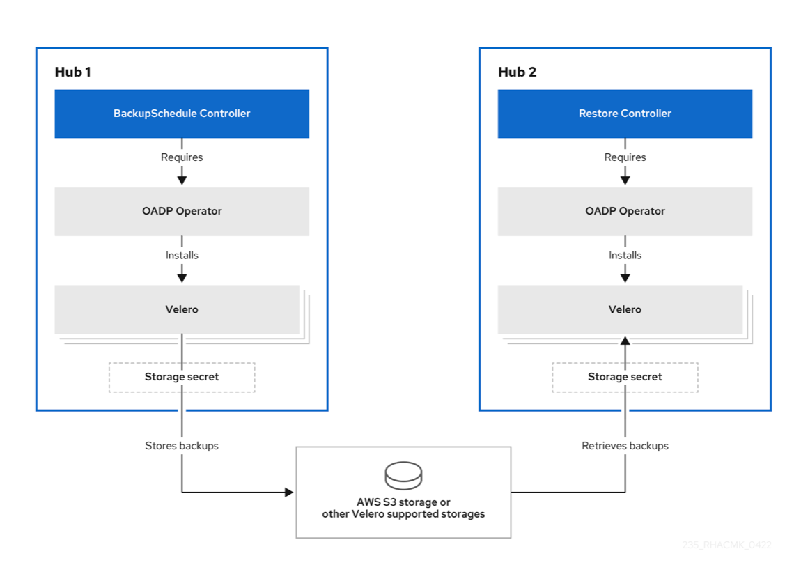
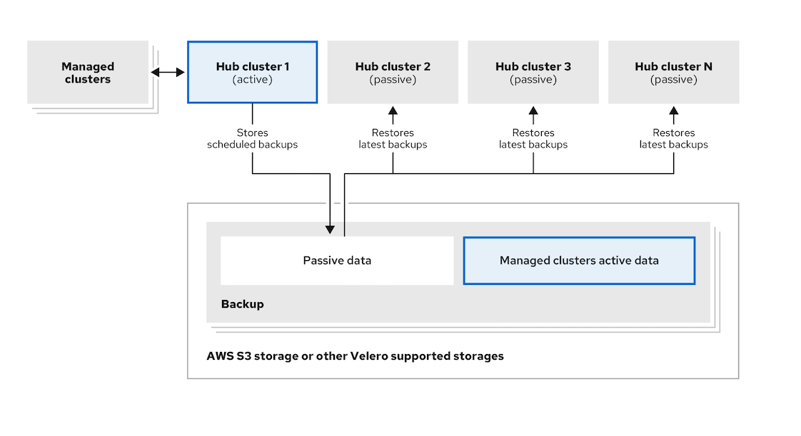
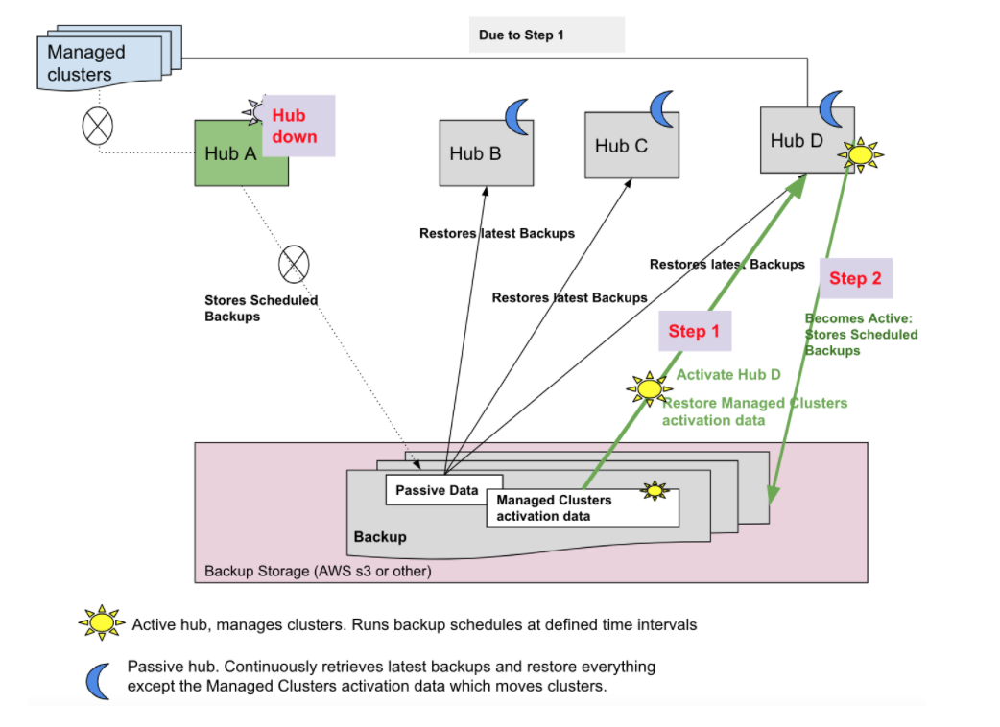

# cluster-backup-operator
Cluster Back up and Restore Operator. 
------

<!-- START doctoc generated TOC please keep comment here to allow auto update -->
<!-- DON'T EDIT THIS SECTION, INSTEAD RE-RUN doctoc TO UPDATE -->
**Table of Contents**  *generated with [DocToc](https://github.com/thlorenz/doctoc)*

  - [Work in Progress](#work-in-progress)
  - [Community, discussion, contribution, and support](#community-discussion-contribution-and-support)
  - [License](#license)
  - [Getting Started](#getting-started)
    - [OADP Operator installed by the backup chart](#oadp-operator-installed-by-the-backup-chart)
    - [Policy to inform on backup configuration issues](#policy-to-inform-on-backup-configuration-issues)
  - [Design](#design)
    - [Cluster Backup and Restore flow](#cluster-backup-and-restore-flow)
    - [What is backed up](#what-is-backed-up)
      - [Steps to identify backup data](#steps-to-identify-backup-data)
      - [Extending backup data](#extending-backup-data)
      - [Resources restored at managed clusters activation time](#resources-restored-at-managed-clusters-activation-time)
    - [Passive data](#passive-data)
    - [Managed clusters activation data](#managed-clusters-activation-data)
    - [Scheduling a cluster backup](#scheduling-a-cluster-backup)
      - [Backup Collisions](#backup-collisions)
    - [Restoring a backup](#restoring-a-backup)
      - [Prepare the new hub](#prepare-the-new-hub)
      - [Restoring backups](#restoring-backups)
        - [Restoring passive resources and check for new backups](#restoring-passive-resources-and-check-for-new-backups)
        - [Restoring passive resources](#restoring-passive-resources)
        - [Restoring activation resources](#restoring-activation-resources)
        - [Restoring all resources](#restoring-all-resources)
      - [Cleaning up the hub before restore](#cleaning-up-the-hub-before-restore)
      - [View restore events](#view-restore-events)
    - [Backup validation using a Policy](#backup-validation-using-a-policy)
      - [Pod validation](#pod-validation)
      - [Backup Storage validation](#backup-storage-validation)
      - [BackupSchedule collision validation](#backupschedule-collision-validation)
      - [BackupSchedule and Restore status validation](#backupschedule-and-restore-status-validation)
      - [Backups exist validation](#backups-exist-validation)
      - [Backups are actively running as a cron job](#backups-are-actively-running-as-a-cron-job)
- [Active passive configuration design](#active-passive-configuration-design)
  - [Setting up an active passive configuration](#setting-up-an-active-passive-configuration)
  - [Disaster recovery](#disaster-recovery)
- [Setting up Your Dev Environment](#setting-up-your-dev-environment)
  - [Prerequiste Tools](#prerequiste-tools)
  - [Installation](#installation)
    - [Outside the Cluster](#outside-the-cluster)
    - [Inside the Cluster](#inside-the-cluster)
- [Usage](#usage)
- [Testing](#testing)

<!-- END doctoc generated TOC please keep comment here to allow auto update -->

------

## Work in Progress
We are in the process of enabling this repo for community contribution. See wiki [here](https://open-cluster-management.io/concepts/architecture/).

## Community, discussion, contribution, and support

Check the [CONTRIBUTING Doc](CONTRIBUTING.md) for how to contribute to the repo.

## License

This project is licensed under the *Apache License 2.0*. A copy of the license can be found in [LICENSE](LICENSE).


## Getting Started
The Cluster Back up and Restore Operator provides disaster recovery solutions for the case when the Red Hat Advanced Cluster Management for Kubernetes hub goes down and needs to be recreated. Scenarios outside the scope of this component : disaster recovery scenarios for applications running on managed clusters or scenarios where the managed clusters go down. 

The Cluster Back up and Restore Operator runs on the Red Hat Advanced Cluster Management for Kubernetes hub and depends on the [OADP Operator](https://github.com/openshift/oadp-operator) to create a connection to a backup storage location on the hub, which is then used to backup and restore user created hub resources. 

The Cluster Back up and Restore Operator chart is not installed automatically. Starting with Red Hat Advanced Cluster Management version 2.5, in order to enable the backup component, you have to set the `cluster-backup` option to `true` on the MultiClusterHub resource. The OADP Operator will be installed automatically with the Cluster Back up and Restore Operator chart, as a chart hook.

Before you can use the Cluster Back up and Restore operator, the [OADP Operator](https://github.com/openshift/oadp-operator/blob/master/docs/install_olm.md) must be configured to set the connection to the storage location where backups will be saved. Make sure you follow the steps to create the [secret for the cloud storage](https://github.com/openshift/oadp-operator/blob/master/docs/install_olm.md#create-credentials-secret) where the backups are going to be saved, then use that secret when creating the [DataProtectionApplication resource](https://github.com/openshift/oadp-operator/blob/master/docs/install_olm.md#create-the-dataprotectionapplication-custom-resource) to setup the connection to the storage location.


### OADP Operator installed by the backup chart
The Cluster Back up and Restore Operator chart is not installed automatically.
Starting with Red Hat Advanced Cluster Management version 2.5, the Cluster Back up and Restore Operator chart is installed by setting the `cluster-backup` option to `true` on the `MultiClusterHub` resource. 

The Cluster Back up and Restore Operator chart in turn automatically installs the [OADP Operator](https://github.com/openshift/oadp-operator/blob/master/docs/install_olm.md), in the same namespace with the backup chart. 

<b>Note</b>: 
- The OADP Operator 1.0 has disabled building multi-arch builds and only produces x86_64 builds for the official release. This means that if you are using an architecture other than x86_64, the OADP Operator installed by the chart will have to be replaced with the right version. In this case, uninstall the OADP Operator and find the operator matching your architecture than install it.
- If you have previously installed and used the OADP Operator on this hub, you should uninstall this version since the backup chart works now with the operator installed in the chart's namespace. This should not affect your old backups and previous work. Just use the same storage location for the [DataProtectionApplication resource](https://github.com/openshift/oadp-operator/blob/master/docs/install_olm.md#create-the-dataprotectionapplication-custom-resource) owned by the OADP Operator installed with the backup chart and it will access the same backup data as the previous operator. The only difference is that velero backup resources are now loaded under the new OADP Operator namespace on this hub.


### Policy to inform on backup configuration issues
The Cluster Back up and Restore Operator chart installs the [backup-restore-enabled](https://github.com/stolostron/cluster-backup-chart/blob/main/stable/cluster-backup-chart/templates/hub-backup-pod.yaml) Policy, used to inform on issues with the backup and restore component. The Policy templates check if the required pods are running, storage location is available, backups are available at the defined location and no error status is reported by the main resources. This Policy is intended to help notify the Hub admin of any backup issues as the hub is active and expected to produce backups.


## Design

The content below describes the backup and restore flow using the Cluster Back up and Restore Operator solution, with details on what and how the data is backed up and restored.
Once you are familiar with these concepts you can follow the [Active passive configuration design](#active-passive-configuration-design) section to understand how to build a complete DR solution with an ACM hub set as a primary, active configuration, managing clusters, and one or more ACM hubs setup to take over in a disaster scenario.


## Cluster Backup and Restore flow

The operator defines the `BackupSchedule.cluster.open-cluster-management.io` resource, used to setup Red Hat Advanced Cluster Management for Kubernetes backup schedules, and the `Restore.cluster.open-cluster-management.io` resource, used to process and restore these backups.
The operator sets the options required to backup remote clusters configuration and any other hub resources that need to be restored.



## What is backed up

The Cluster Back up and Restore Operator solution provides backup and restore support for all Red Hat Advanced Cluster Management for Kubernetes hub resources like managed clusters, applications, policies, bare metal assets.
It  provides support for backing up any third party resources extending the basic hub installation. 
With this backup solution, you can define a cron based backup schedule which runs at specified time intervals and continuously backs up the latest version of the hub content.
When the hub needs to be replaced or in a disaster scenario when the hub goes down, a new hub can be deployed and backed up data moved to the new hub, so that the new hub replaces the old one.

### Steps to identify backup data

The steps below show how the Cluster Back up and Restore Operator finds the resources to be backed up.
With this approach the backup includes all CRDs installed on the hub, including any extensions using third parties components.


1. Exclude all resources in the MultiClusterHub namespace. This is to avoid backing up installation resources which are linked to the current Hub identity and should not be backed up.
2. Backup all CRDs with an api version suffixed by `.open-cluster-management.io`. This will cover all Advanced Cluster Management resources.
3. Additionally, backup all CRDs from these api groups: `argoproj.io`,`app.k8s.io`,`core.observatorium.io`,`hive.openshift.io`
4. Exclude all CRDs from the following api groups : `admission.cluster.open-cluster-management.io`,
  `admission.work.open-cluster-management.io`,
  `internal.open-cluster-management.io`,
  `operator.open-cluster-management.io`,
  `work.open-cluster-management.io`,
  `search.open-cluster-management.io`,
  `admission.hive.openshift.io`,
  `velero.io`
5. Exclude the following CRDs; they are part of the included api groups but are either not needed or they are being recreated by owner resources, which are also backed up: `clustermanagementaddon`, `observabilityaddon`, `applicationmanager`,`certpolicycontroller`,`iampolicycontroller`,`policycontroller`,`searchcollector`,`workmanager`,`backupschedule`,`restore`,`clusterclaim.cluster.open-cluster-management.io`
6. Backup secrets and configmaps with one of the following label annotations:
`cluster.open-cluster-management.io/type`, `hive.openshift.io/secret-type`, `cluster.open-cluster-management.io/backup`
7. Use this label annotation for any other resources that should be backed up and are not included in the above criteria: `cluster.open-cluster-management.io/backup`
8. Resources picked up by the above rules that should not be backed up, can be explicitly excluded when setting this label annotation: `velero.io/exclude-from-backup=true` 

### Extending backup data
Third party components can choose to back up their resources with the ACM backup by adding the `cluster.open-cluster-management.io/backup` label to these resources. The value of the label could be any string, including an empty string. It is indicated though to set a value that can be later on used to easily identify the component backing up this resource. For example `cluster.open-cluster-management.io/backup: idp` if the components are provided by an idp solution.

<b>Note:</b> 
Use the `cluster-activation` value for the `cluster.open-cluster-management.io/backup` label if you want the resources to be restored when the managed clusters activation resources are restored. Restoring the managed clusters activation resources result in managed clusters being actively managed by the hub where the restore was executed. 

### Resources restored at managed clusters activation time

As mentioned above, when you add the `cluster.open-cluster-management.io/backup` label to a resource, this resource is automatically backed up under the `acm-resources-generic-schedule` backup. If any of these resources need to be restored only when the managed clusters are moved to the new hub, so when the `veleroManagedClustersBackupName:latest` is used on the restored resource, then you have to set the label value to `cluster-activation`. This will ensure the resource is not restored unless the managed cluster activation is called.
Example :
```yaml
apiVersion: my.group/v1alpha1
kind: MyResource
metadata:
  labels:
    cluster.open-cluster-management.io/backup: cluster-activation
``` 

Aside of these activation data resources, identified by using the `cluster.open-cluster-management.io/backup: cluster-activation` label and stored by the `acm-resources-generic-schedule` backup, the Cluster Back up and Restore Operator includes by default a few resources in the activation set. These resources are backed up by the `acm-managed-clusters-schedule`:
  - managedcluster.cluster.open-cluster-management.io
  - managedcluster.clusterview.open-cluster-management.io
  - klusterletaddonconfig.agent.open-cluster-management.io
  - managedclusteraddon.addon.open-cluster-management.io
  - managedclusterset.cluster.open-cluster-management.io
  - managedclusterset.clusterview.open-cluster-management.io
  - managedclustersetbinding.cluster.open-cluster-management.io
  - clusterpool.hive.openshift.io
  - clusterclaim.hive.openshift.io
  - clustercurator.cluster.open-cluster-management.io

## Passive data

Passive data is backup data such as secrets, configmaps, apps, policies and all the managed cluster custom resources which are not resulting in activating the connection between managed clusters and hub where these resources are being restored on. These resources are stored by the credentials backup and resources backup files.

## Managed clusters activation data

Managed clusters activation data or activation data, is backup data which when restored on a new hub will result in managed clusters being actively managed by the hub where the restore was executed. Activation data resources are stored by the managed clusters backup, and by the resources-generic backup, using the `cluster.open-cluster-management.io/backup: cluster-activations` label. More details about the activation resources are available with the [backup section](#resources-restored-at-managed-clusters-activation-time)

## Scheduling a cluster backup 

A backup schedule is activated when creating the `backupschedule.cluster.open-cluster-management.io` resource, as shown [here](https://github.com/stolostron/cluster-backup-operator/blob/main/config/samples/cluster_v1beta1_backupschedule.yaml)

After you create a `backupschedule.cluster.open-cluster-management.io` resource you should be able to run `oc get bsch -n <oadp-operator-ns>` and get the status of the scheduled cluster backups. The `<oadp-operator-ns>` is the namespace where BackupSchedule was created and it should be the same namespace where the OADP Operator was installed.

The `backupschedule.cluster.open-cluster-management.io` creates 6 `schedule.velero.io` resources, used to generate the backups.

Run `os get schedules -A | grep acm` to view the list of backup scheduled.

Resources are backed up in 3 separate groups:
1. credentials backup ( 3 backup files, for hive, ACM and generic backups )
2. resources backup ( 2 backup files, one for the ACM resources and second for generic resources, labeled with `cluster.open-cluster-management.io/backup`)

3. managed clusters backup, schedule labeled with `cluster.open-cluster-management.io/backup-schedule-type: acm-managed-clusters` ( one backup containing only resources which result in activating the managed cluster connection to the hub where the backup was restored on)


<b>Note</b>:

a. The backup file created in step 2. above contains managed cluster specific resources but does not contain the subset of resources which will result in managed clusters connect to this hub. These resources, also called activation resources, are contained by the managed clusters backup, created in step 3. When you restore on a new hub just the resources from step 1 and 2 above, the new hub shows all managed clusters but they are in a detached state. The managed clusters are still connected to the original hub that had produced the backup files.

b. Only managed clusters created using the hive api will be automatically connected with the new hub when the `acm-managed-clusters` backup from step 3 is restored on another hub. All other managed clusters will show up as `Pending Import` and must be imported back on the new hub.

c. When restoring the `acm-managed-clusters` backup on a new hub, by using the `veleroManagedClustersBackupName: latest` option on the restore resource, make sure the old hub from where the backups have been created is shut down, otherwise the old hub will try to reconnect with the managed clusters as soon as the managed cluster reconciliation addons find the managed clusters are no longer available, so both hubs will try to manage the clusters at the same time.

### Backup Collisions

As hubs change from passive to primary clusters and back, different clusters can backup up data at the same storage location. This could result in backup collisions, which means the latest backups are generated by a hub who is no longer the designated primary hub. That hub produces backups because the `BackupSchedule.cluster.open-cluster-management.io` resource is still Enabled on this hub, but it should no longer write backup data since that hub is no longer a primary hub.
Situations when a backup collision could happen:
1. Primary hub goes down unexpectedly:
    - 1.1) Primary hub, Hub1, goes down 
    - 1.2) Hub1 backup data is restored on Hub2
    - 1.3) The admin creates the `BackupSchedule.cluster.open-cluster-management.io` resource on Hub2. Hub2 is now the primary hub and generates backup data to the common storage location. 
    - 1.4) Hub1 comes back to life unexpectedly. Since the `BackupSchedule.cluster.open-cluster-management.io` resource is still enabled on Hub1, it will resume writting backups to the same storage location as Hub2. Both Hub1 and Hub2 are now writting backup data at the same storage location. Any cluster restoring the latest backups from this storage location could pick up Hub1 data instead of Hub2.
2. The admin tests the disaster scenario by making Hub2 a primary hub:
    - 2.1) Hub1 is stopped
    - 2.2) Hub1 backup data is restored on Hub2
    - 2.3) The admin creates the `BackupSchedule.cluster.open-cluster-management.io` resource on Hub2. Hub2 is now the primary hub and generates backup data to the common storage location. 
    - 2.4) After the disaster test is completed, the admin will revert to the previous state and make Hub1 the primary hub:
        - 2.4.1) Hub1 is started. Hub2 is still up though and the `BackupSchedule.cluster.open-cluster-management.io` resource is Enabled on Hub2. Until Hub2 `BackupSchedule.cluster.open-cluster-management.io` resource is deleted or Hub2 is stopped, Hub2 could write backups at any time at the same storage location, corrupting the backup data. Any cluster restoring the latest backups from this location could pick up Hub2 data instead of Hub1. The right approach here would have been to first stop Hub2 or delete the `BackupSchedule.cluster.open-cluster-management.io` resource on Hub2, then start Hub1.

In order to avoid and to report this type of backup collisions, a BackupCollision state exists for a  `BackupSchedule.cluster.open-cluster-management.io` resource. The controller checks regularly if the latest backup in the storage location has been generated from the current cluster. If not, it means that another cluster has more recently written backup data to the storage location so this hub is in collision with another hub.

In this case, the current hub `BackupSchedule.cluster.open-cluster-management.io` resource status is set to BackupCollision and the `Schedule.velero.io` resources created by this resource are deleted to avoid data corruption. The BackupCollision is reported by the [backup Policy](https://github.com/stolostron/cluster-backup-chart/blob/main/stable/cluster-backup-chart/templates/hub-backup-pod.yaml). The admin should verify what hub must be the one writting data to the  storage location, than remove the `BackupSchedule.cluster.open-cluster-management.io` resource from the invalid hub and recreated a new `BackupSchedule.cluster.open-cluster-management.io` resource on the valid, primary hub, to resume the backup on this hub. 

Example of a schedule in `BackupCollision` state:

```
oc get backupschedule -A
NAMESPACE       NAME               PHASE             MESSAGE
openshift-adp   schedule-hub-1   BackupCollision   Backup acm-resources-schedule-20220301234625, from cluster with id [be97a9eb-60b8-4511-805c-298e7c0898b3] is using the same storage location. This is a backup collision with current cluster [1f30bfe5-0588-441c-889e-eaf0ae55f941] backup. Review and resolve the collision then create a new BackupSchedule resource to  resume backups from this cluster.
```

## Restoring a backup

### Prepare the new hub
Before running the restore operation on a new hub, you need to manually configure the hub and install the same operators as on the initial hub. For example, you have to install the Red Hat Advanced Cluster Management for Kubernetes operator, in the same namespace as the initial hub, then create the [DataProtectionApplication resource](https://github.com/openshift/oadp-operator/blob/master/docs/install_olm.md#create-the-dataprotectionapplication-custom-resource) and connect to the same storage location where the initial hub had backed up data. If the initial hub had any other operators installed, you have to install them now, before running the restore operation. This ensure the new hub is configured in the same way as the initial hub.

The new hub must use the same namespace names as the old hub when installing the Red Hat Advanced Cluster Management for Kubernetes operator and any other operators configured on the previous hub.

### Restoring backups
In a usual restore scenario, the hub where the backups have been executed becomes unavailable and data backed up needs to be moved to a new hub. This is done by running the restore operation on the hub where the backed up data needs to be moved to. In this case, the restore operation is executed on a different hub than the one where the backup was created. 

There are also cases where you want to restore the data on the same hub where the backup was collected, in order to recover data from a previous snapshot. In this case both restore and backup operations are executed on the same hub.

A restore backup is executed when creating the `restore.cluster.open-cluster-management.io` resource on the hub. A few samples are available [here](https://github.com/stolostron/cluster-backup-operator/tree/main/config/samples)

By passive data we mean resource that don't result in activating the connection between the new hub and managed clusters. When the passive data is restored on the new hub, the managed clusters show up but they are in detached state. The hub that produced the backup is still managing these clusters.

By activation data we mean resources that, when restored on the new hub, result in making the managed clusters to be managed by the new hub. The new hub is now the active hub, managing the clusters.

#### Restoring passive resources and check for new backups


Use the [restore passive with sync sample](https://github.com/stolostron/cluster-backup-operator/blob/main/config/samples/cluster_v1beta1_restore_passive_sync.yaml) if you want to restore passive data then keep checking if new backups are available and restore them automatically. For this automatic restore of new backups to work, the restore must set `syncRestoreWithNewBackups` property to `true` and must only restore latest, passive data. So for this option to work, you need to set `VeleroResourcesBackupName` and `VeleroCredentialsBackupName` to `latest` and the `VeleroManagedClustersBackupName` to `skip` - as soon as the `VeleroManagedClustersBackupName` is set to `latest`, the managed clusters are activated on the new hub and this hub becomes a primary hub. When this happens, the restore resource is set to `Finished` and the `syncRestoreWithNewBackups` is ignored, even if set to `true`. The restore operation has completed.

By default, when `syncRestoreWithNewBackups` is set to `true`, the controller checks for new backups every 30 minutes. If new backups are found, it restores the backed up resources. You can update the duration after which you want the controller to check for new backups using this property `restoreSyncInterval`. 

For example, the resource below checks for new backups every 10 minutes.

```yaml
apiVersion: cluster.open-cluster-management.io/v1beta1
kind: Restore
metadata:
  name: restore-acm-passive-sync
spec:
  syncRestoreWithNewBackups: true # restore again when new backups are available
  restoreSyncInterval: 10m # check for new backups every 10 minutes
  cleanupBeforeRestore: CleanupRestored 
  veleroManagedClustersBackupName: skip
  veleroCredentialsBackupName: latest
  veleroResourcesBackupName: latest
```

#### Restoring passive resources

Use the [passive sample](https://github.com/stolostron/cluster-backup-operator/blob/main/config/samples/cluster_v1beta1_restore_passive.yaml) if you want to restore all resources on the new hub but you don't want to have the managed clusters be managed by the new hub. You can use this restore configuration when the initial hub is still up and you want to prevent the managed clusters to change ownership. You could use this restore option when you want to view the initial hub content using the new hub or to prepare the new hub to take over when needed. In the case of takeover, just restore the managed clusters resources using the [passive activation sample](https://github.com/stolostron/cluster-backup-operator/blob/main/config/samples/cluster_v1beta1_restore_passive_activate.yaml); the managed clusters will now connect with the new hub.

#### Restoring activation resources

Use the [passive activation sample](https://github.com/stolostron/cluster-backup-operator/blob/main/config/samples/cluster_v1beta1_restore_passive_activate.yaml) when you want for this hub to manage the clusters. In this case it is assumed that the other data has been restored already on this hub using the [passive sample](https://github.com/stolostron/cluster-backup-operator/blob/main/config/samples/cluster_v1beta1_restore_passive.yaml)

#### Restoring all resources

Use the [restore sample](https://github.com/stolostron/cluster-backup-operator/blob/main/config/samples/cluster_v1beta1_restore.yaml) if you want to restore all data at once and make this hub take over the managed clusters in one step.

After you create a `restore.cluster.open-cluster-management.io` resource on the hub, you should be able to run `oc get restore -n <oadp-operator-ns>` and get the status of the restore operation. You should also be able to verify on your hub that the backed up resources contained by the backup file have been created.

### Cleaning up the hub before restore
Velero currently skips backed up resources if they are already installed on the hub. This limits the scenarios that can be used when restoring hub data on a new hub. Unless the new hub is not used and the restore is applied only once, the hub could not be relibly used as a passive configuration: the data on this hub is not reflective of the data available with the restored resources.

Restore limitations examples:
1. A Policy exists on the new hub, before the backup data is restored on this hub. After the restore of the backup resources, the new hub is not identical with the initial hub from where the data was restored. The Policy should not be running on the new hub since this is a Policy not available with the backup resources.
2. A Policy exists on the new hub, before the backup data is restored on this hub. The backup data contains the same Policy but in an updated configuration. Since Velero skips existing resources, the Policy will stay unchanged on the new hub, so the Policy is not the same as the one backed up on the initial hub.
3. A Policy is restored on the new hub. The primary hub keeps updating the content and the Policy content changes as well. The user reapplies the backup on the new hub, expecting to get the updated Policy. Since the Policy already exists on the hub - created by the previous restore - it will not be restored again. So the new hub has now a different configuration from the primary hub, even if the backup contains the expected updated content; that content is not updated by Velero on the new hub.

To address above limitations, when a `Restore.cluster.open-cluster-management.io` resource is created, the Cluster Back up and Restore Operator runs a prepare for restore set of steps which will clean up the hub, before Velero restore is called. 

The prepare for cleanup option uses the `cleanupBeforeRestore` property to identify the subset of objects to clean up. There are 3 options you could set for this clean up: 
- `None` : no clean up necessary, just call Velero restore. This is to be used on a brand new hub.
- `CleanupRestored` : clean up all resources created by a previous acm restore. This should be the common usage for this property. It is less intrusive then the `CleanupAll` and covers the scenario where you start with a clean hub and keep restoring resources on this hub ( limitation sample 3 above )
- `CleanupAll` : clean up all resources on the hub which could be part of an acm backup, even if they were not created as a result of a restore operation. This is to be used when extra content has been created on this hub which requires clean up ( limitation samples 1 and 2 above ). Use this option with caution though as this will cleanup resources on the hub created by the user, not by a previous backup. It is <b>strongly recommended</b> to use the `CleanupRestored` option and to refrain from manually updating hub content when the hub is designated as a passive candidate for a disaster scenario. Basically avoid getting into the situation where you have to swipe the cluster using the `CleanupAll` option; this is given as a last alternative.

<b>Note:</b> 

1. Velero sets a `PartiallyFailed` status for a velero restore resource if the backup restored had no resources. This means that a `restore.cluster.open-cluster-management.io` resource could be in `PartiallyFailed` status if any of the `restore.velero.io` resources created did not restore any resources because the corresponding backup was empty.

2. The `restore.cluster.open-cluster-management.io` resource is executed once, unless you use the `syncRestoreWithNewBackups:true` to keep restoring passive data when new backups are available.For this case, follow the [restore passive with sync sample](https://github.com/stolostron/cluster-backup-operator/blob/main/config/samples/cluster_v1beta1_restore_passive_sync.yaml). After the restore operation is completed, if you want to run another restore operation on the same hub, you have to create a new `restore.cluster.open-cluster-management.io` resource.

3. Although you can create multiple `restore.cluster.open-cluster-management.io` resources, only one is allowed to be executing at any moment in time.

4. The restore operation allows to restore all 3 backup types created by the backup operation, although you can choose to install only a certain type (only managed clusters or only user credentials or only hub resources). 

The restore defines 3 required spec properties, defining the restore logic for the 3 type of backed up files. 
- `veleroManagedClustersBackupName` is used to define the restore option for the managed clusters. 
- `veleroCredentialsBackupName` is used to define the restore option for the user credentials. 
- `veleroResourcesBackupName` is used to define the restore option for the hub resources (applications and policies). 

The valid options for the above properties are : 
  - `latest` - restore the last available backup file for this type of backup
  - `skip` - do not attempt to restore this type of backup with the current restore operation
  - `<backup_name>` - restore the specified backup pointing to it by name

Below you can see a sample available with the operator.

```yaml
apiVersion: cluster.open-cluster-management.io/v1beta1
kind: Restore
metadata:
  name: restore-acm
  namespace: open-cluster-management-backup
spec:
  cleanupBeforeRestore: CleanupRestored
  veleroManagedClustersBackupName: latest
  veleroCredentialsBackupName: latest
  veleroResourcesBackupName: latest
```

### View restore events

Use the `oc describe -n <oadp-n> <restore-name>` command to get information about restore events.
A sample output is shown below

```yaml
Spec:
  Cleanup Before Restore:               CleanupRestored
  Restore Sync Interval:                4m
  Sync Restore With New Backups:        true
  Velero Credentials Backup Name:       latest
  Velero Managed Clusters Backup Name:  skip
  Velero Resources Backup Name:         latest
Status:
  Last Message:                     Velero restores have run to completion, restore will continue to sync with new backups
  Phase:                            Enabled
  Velero Credentials Restore Name:  example-acm-credentials-schedule-20220325220057
  Velero Resources Restore Name:    example-acm-resources-schedule-20220325220057
Events:
  Type    Reason                                                 Age   From                Message
  ----    ------                                                 ----  ----                -------
  Normal  Processing restore request                             89s   Restore controller  Restore sync found new backups
  Normal  Prepare to restore, cleaning up resources for backup:  89s   Restore controller  acm-resources-generic-schedule-20220325220057
  Normal  Prepare to restore, cleaning up resources for backup:  66s   Restore controller  acm-resources-schedule-20220325220057
  Normal  Prepare to restore, cleaning up resources for backup:  61s   Restore controller  acm-credentials-hive-schedule-20220325220057
  Normal  Prepare to restore, cleaning up resources for backup:  60s   Restore controller  acm-credentials-cluster-schedule-20220325220057
  Normal  Prepare to restore, cleaning up resources for backup:  59s   Restore controller  acm-credentials-schedule-20220325220057
  Normal  Velero restore created:                                58s   Restore controller  example-acm-credentials-hive-schedule-20220325220057
  Normal  Velero restore created:                                58s   Restore controller  example-acm-credentials-cluster-schedule-20220325220057
  Normal  Velero restore created:                                58s   Restore controller  example-acm-credentials-schedule-20220325220057
  Normal  Velero restore created:                                58s   Restore controller  example-acm-resources-generic-schedule-20220325220057
  Normal  Velero restore created:                                58s   Restore controller  example-acm-resources-schedule-20220325220057
  Normal  Processing restore request                             43s   Restore controller  Restore sync found no new backups

```

## Backup validation using a Policy

The Cluster Back up and Restore Operator [chart](https://github.com/stolostron/cluster-backup-chart) installs the [backup-restore-enabled](https://github.com/stolostron/cluster-backup-chart/blob/main/stable/cluster-backup-chart/templates/hub-backup-pod.yaml) Policy, used to inform on issues with the backup and restore component. 

The Policy has a set of templates which check for the following constraints and informs when any of them are violated. 

### Pod validation
The following templates check the pod status for the backup component and dependencies:
- `acm-backup-pod-running` template checks if Backup and Restore operator pod is running 
- `oadp-pod-running` template checks if OADP operator pod is running
- `velero-pod-running` template checks if Velero pod is running

### Backup Storage validation
- `backup-storage-location-available` template checks if a  `BackupStorageLocation.velero.io` resource was created and the status is `Available`. This implies that the connection to the backup storage is valid.

### BackupSchedule collision validation
- `acm-backup-clusters-collision-report` template checks that if a `BackupSchedule.cluster.open-cluster-management.io` exists on the current hub, its state is not `BackupCollision`. This verifies that the current hub is not in collision with any other hub when writing backup data to the storage location. For a definition of the BackupCollision state read the [Backup Collisions section](#backup-collisions) 

### BackupSchedule and Restore status validation
- `acm-backup-phase-validation` template checks that if a `BackupSchedule.cluster.open-cluster-management.io` exists on the current cluster, the status is not in (Failed, or empty state). This ensures that if this cluster is the primary hub and is generating backups, the `BackupSchedule.cluster.open-cluster-management.io` status is healthy.
- the same template checks that if a `Restore.cluster.open-cluster-management.io` exists on the current cluster, the status is not in (Failed, or empty state). This ensures that if this cluster is the secondary hub and is restoring backups, the `Restore.cluster.open-cluster-management.io` status is healthy.

### Backups exist validation
- `acm-managed-clusters-schedule-backups-available` template checks if `Backup.velero.io` resources are available at the location specified by the `BackupStorageLocation.velero.io` and the backups were created by a `BackupSchedule.cluster.open-cluster-management.io` resource. This validates that the backups have been executed at least once, using the Backup and restore operator.

### Backups are actively running as a cron job
- This validation is done by the `backup-schedule-cron-enabled` template. It checks that a `BackupSchedule.cluster.open-cluster-management.io` is actively running and creating new backups at the storage location.  The template verifies there is a `Backup.velero.io` with a label `velero.io/schedule-name: acm-validation-policy-schedule` at the storage location. The `acm-validation-policy-schedule` backups are set to expire after the time set for the backups cron schedule. If no cron job is running anymore to create backups, the old `acm-validation-policy-schedule` backup is deleted because it expired and a new one is not created. So if no `acm-validation-policy-schedule` backup exists at any moment in time, it means that there are no active cron jobs generating acm backups.

This Policy is intended to help notify the Hub admin of any backup issues as the hub is active and expected to produce or restore backups.

# Active passive configuration design

## Setting up an active passive configuration

In an active passive configuration you have 
- one hub, called active or primary hub, which manages the clusters and is backing up resources at defined time intervals, using the `BackupSchedule.cluster.open-cluster-management.io` resource
- one or more passive hubs, which are continously retrieving the latest backups and restoring the [passive data](#passive-data). The passive hubs use the `Restore.cluster.open-cluster-management.io` resource to keep restoring passive data posted by the primary hub, when new backup data is available. These hubs are on standby to become a primary hub when the primary hub goes down. They are connected to the same storage location where the primary hub backs up data so they can access the primary hub backups. For more details on how to setup this automatic restore configuration see the [Restoring passive resources and check for new backups](#restoring-passive-resources-and-check-for-new-backups) section.

In the image below, the active hub manages the remote clusters and backs up hub data at regular intervals.
The passive hubs restore this data, except for the managed clusters activation data, which would move the managed clusters to the passive hub. The passive hubs can restore the passive data continously, or as a one time operation.



## Disaster recovery

When the primary hub goes down, one of the passive hubs is chosen by the admin to take over the managed clusters. In the image below, the admin decides to use Hub D as the new primary hub. These are the steps taken to have Hub D become a primary hub: 
1. Hub D restores the [Managed Cluster activation data](#managed-clusters-activation-data). At this point, the managed clusters connect with Hub D.
2. The admin starts a backup on the new primary Hub D, by creating a `BackupSchedule.cluster.open-cluster-management.io` resource and storing the backups at the same storage location as the initial primary hub. All other passive hubs will now restore [passive data](#passive-data) using the backup data created by the new primary hub, unaware that the primary hub has changed. Hub D behaves now as the primary hub, managing clusters and backing up data.

Note: 
- Step 1 is not automated since the admin should decide if the primary hub is down and needs to be replaced, or there is some network communication error between the hub and managed clusters. The admin also decides which passive hub should become primary. If desired, this step could be automated using the Policy integration with Ansible jobs: the admin can setup an Ansible job to be executed when the [Backup Policy](#backup-validation-using-a-policy) reports backup execution errors.
- Although Step 2 above is manual, the admin will be notified using the [Backups are actively running as a cron job](#backups-are-actively-running-as-a-cron-job) if he omits to start creating backups from the new primary hub. 




# Setting up Your Dev Environment

## Prerequiste Tools
- Operator SDK

## Installation

To install the Cluster Back up and Restore Operator, you can either run it outside the cluster,
for faster iteration during development, or inside the cluster.

First we require installing the Operator CRD:

```shell
make build
make install
```

Then proceed to the installation method you prefer below.

### Outside the Cluster

If you would like to run the Cluster Back up and Restore Operator outside the cluster, execute:

```shell
make run
```

### Inside the Cluster

If you would like to run the Operator inside the cluster, you'll need to build
a container image. You can use a local private registry, or host it on a public
registry service like [quay.io](https://quay.io).

1. Build your image:
    ```shell
    make docker-build IMG=<registry>/<imagename>:<tag>
    ```
1. Push the image:
    ```shell
    make docker-push IMG=<registry>/<imagename>:<tag>
    ```
1. Deploy the Operator:
    ```shell
    make deploy IMG=<registry>/<imagename>:<tag>
    ```


## Usage

Here you can find an example of a `backupschedule.cluster.open-cluster-management.io` resource definition:

```yaml
apiVersion: cluster.open-cluster-management.io/v1beta1
kind: BackupSchedule
metadata:
  name: schedule-acm
spec:
  veleroSchedule: 0 */6 * * * # Create a backup every 6 hours
  veleroTtl: 72h # deletes scheduled backups after 72h; optional, if not specified, the maximum default value set by velero is used - 720h
```

- `veleroSchedule` is a required property and defines a cron job for scheduling the backups.

- `veleroTtl` is an optional property and defines the expiration time for a scheduled backup resource. If not specified, the maximum default value set by velero is used, which is 720h.


This is an example of a `restore.cluster.open-cluster-management.io` resource definition

```yaml
apiVersion: cluster.open-cluster-management.io/v1beta1
kind: Restore
metadata:
  name: restore-acm
spec:
  cleanupBeforeRestore: CleanupRestored
  veleroManagedClustersBackupName: latest
  veleroCredentialsBackupName: latest
  veleroResourcesBackupName: latest
```


In order to create an instance of `backupschedule.cluster.open-cluster-management.io` or `restore.cluster.open-cluster-management.io` you can start from one of the [sample configurations](config/samples).
Replace the `<oadp-operator-ns>` with the namespace name used to install the OADP Operator.


```shell
kubectl create -n <oadp-operator-ns> -f config/samples/cluster_v1beta1_backupschedule.yaml
kubectl create -n <oadp-operator-ns> -f config/samples/cluster_v1beta1_restore.yaml
```

# Testing

## Schedule  a backup 

After you create a `backupschedule.cluster.open-cluster-management.io` resource you should be able to run `oc get bsch -n <oadp-operator-ns>` and get the status of the scheduled cluster backups.

In the example below, you have created a `backupschedule.cluster.open-cluster-management.io` resource named schedule-acm.

The resource status shows the definition for the 3 `schedule.velero.io` resources created by this cluster backup scheduler. 

```
$ oc get bsch -n <oadp-operator-ns>
NAME           PHASE
schedule-acm   
```

## Restore a backup

After you create a `restore.cluster.open-cluster-management.io` resource on the new hub, you should be able to run `oc get restore -n <oadp-operator-ns>` and get the status of the restore operation. You should also be able to verify on the new hub that the backed up resources contained by the backup file have been created.

Velero sets a `PartiallyFailed` status for a velero restore resource if the backup restored had no resources. This means that a `restore.cluster.open-cluster-management.io` resource could be in `PartiallyFailed` status if any of the `restore.velero.io` resources created did not restore any resources because the corresponding backup was empty. 

The restore defines 3 required spec properties, defining the restore logic for the 3 type of backed up files. 
- `veleroManagedClustersBackupName` is used to define the restore option for the managed clusters. 
- `veleroCredentialsBackupName` is used to define the restore option for the user credentials. 
- `veleroResourcesBackupName` is used to define the restore option for the hub resources (applications and policies). 

The valid options for the above properties are : 
  - `latest` - restore the last available backup file for this type of backup
  - `skip` - do not attempt to restore this type of backup with the current restore operation
  - `<backup_name>` - restore the specified backup pointing to it by name

The `cleanupBeforeRestore` property is used to clean up resources before the restore is executed. More details about this options [here](#cleaning-up-the-hub-before-restore).

<b>Note:</b> The `restore.cluster.open-cluster-management.io` resource is executed once. After the restore operation is completed, if you want to run another restore operation on the same hub, you have to create a new `restore.cluster.open-cluster-management.io` resource.


Below is an example of a `restore.cluster.open-cluster-management.io` resource, restoring all 3 types of backed up files, using the latest available backups:

```yaml
apiVersion: cluster.open-cluster-management.io/v1beta1
kind: Restore
metadata:
  name: restore-acm
spec:
  cleanupBeforeRestore: CleanupRestored
  veleroManagedClustersBackupName: latest
  veleroCredentialsBackupName: latest
  veleroResourcesBackupName: latest
```

You can define a restore operation where you only restore the managed clusters:

```yaml
apiVersion: cluster.open-cluster-management.io/v1beta1
kind: Restore
metadata:
  name: restore-acm
spec:
  cleanupBeforeRestore: None
  veleroManagedClustersBackupName: latest
  veleroCredentialsBackupName: skip
  veleroResourcesBackupName: skip
```

The sample below restores the managed clusters from backup `acm-managed-clusters-schedule-20210902205438` :

```yaml
apiVersion: cluster.open-cluster-management.io/v1beta1
kind: Restore
metadata:
  name: restore-acm
spec:
  cleanupBeforeRestore: None
  veleroManagedClustersBackupName: acm-managed-clusters-schedule-20210902205438
  veleroCredentialsBackupName: skip
  veleroResourcesBackupName: skip
```
